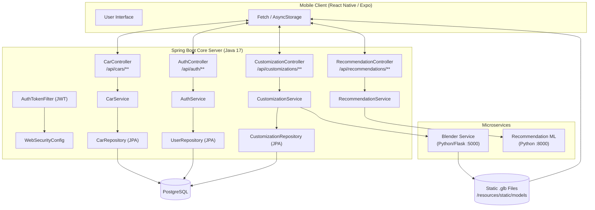
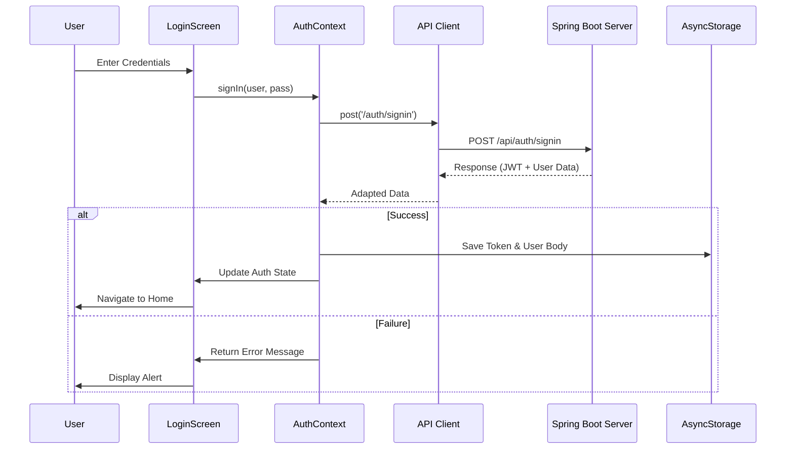
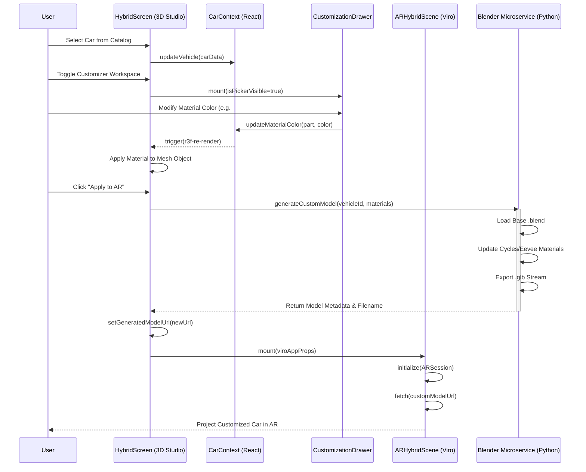
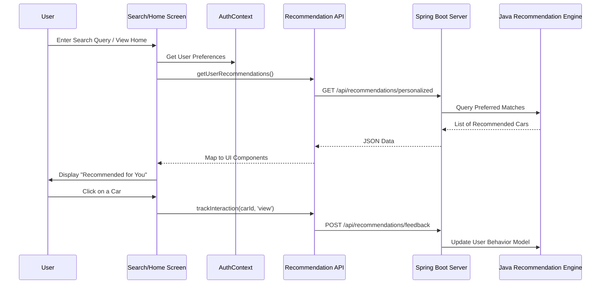
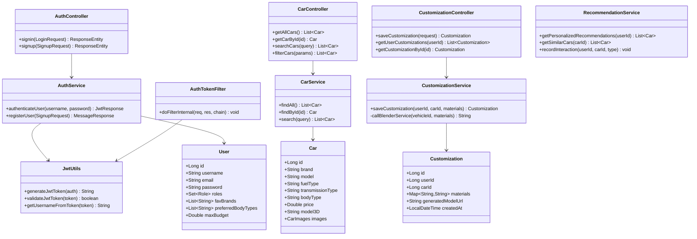
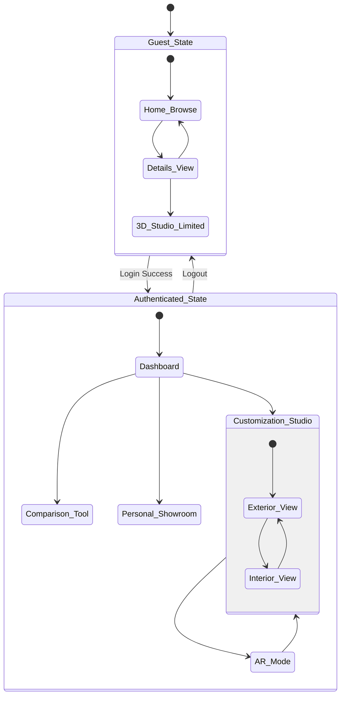
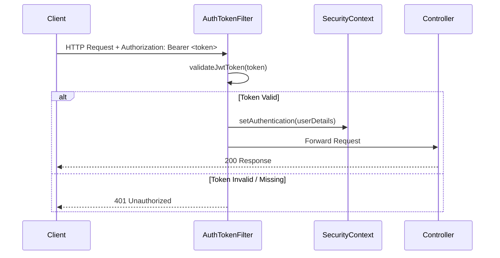

# 🖥️ AR Car Showcase — Server

The backend for the **AR Car Showcase** mobile application. Built with **Spring Boot** (Java 17) and a **Python** microservice for 3D model processing. Exposes a RESTful API for car data, user authentication, customization, and AI-powered recommendations.

---

## 🛠️ Tech Stack

| Layer | Technology |
|---|---|
| Core API | Spring Boot 3.x (Java 17) |
| Build Tool | Maven |
| Security | Spring Security + JWT |
| Database | PostgreSQL / MySQL (JPA/Hibernate) |
| 3D Processing | Python 3.x + Flask + Blender headless |
| Recommendation Engine | Java (Spring Service) + Python ML |
| Static Model Hosting | Spring Boot Static Resources |

---

## ✨ Features

- 🔐 **JWT Authentication** – Stateless sign-in/sign-up with token-based session management
- 🚗 **Car Catalog API** – Full CRUD for car data with filtering by brand, body type, fuel type, and budget
- 🎨 **3D Customization Engine** – Triggers a Python/Blender microservice to generate custom GLB models
- 🤖 **Recommendation Engine** – Personalized car suggestions based on user preferences and viewing history
- 💾 **Customization Persistence** – Saves and retrieves user-specific design configurations
- 🌐 **Cross-Origin Support** – Configured for React Native / Expo mobile client

---

## 🏗️ System Architecture



---

## 🔄 Sequence Diagram: Authentication Flow



---

## 🔄 Sequence Diagram: 3D Studio & AR Flow



---

## 🔄 Sequence Diagram: Recommendation & Search Flow



---

## 📊 Class Diagram: Core Logic



---

## 🔁 State Machine Diagram



---

## 📂 Project Structure

```
AR-Car-Showcase-Server/
│
├── src/
│   └── main/
│       ├── java/com/arcarshowcaseserver/
│       │   ├── controller/           # REST Controllers (Auth, Car, Customization, Recommendation)
│       │   ├── service/              # Business logic layer
│       │   ├── repository/           # Spring Data JPA repositories
│       │   ├── model/                # JPA Entities (User, Car, Customization)
│       │   ├── payload/              # Request/Response DTOs
│       │   ├── security/             # JWT utils, AuthTokenFilter, WebSecurityConfig
│       │   └── ArCarShowcaseServerApplication.java
│       └── resources/
│           ├── application.properties
│           ├── static/models/        # Hosted .glb 3D model files
│           └── data/cars_data_final.json  # Car catalog seed data
│
├── blender-service/                  # Python Flask microservice
│   ├── server.py                     # Flask API entry point
│   ├── generate.py                   # Blender headless script
│   └── requirements.txt
│
├── car-recommendation-service/       # Recommendation microservice
├── pom.xml                           # Maven build file
└── mvnw / mvnw.cmd                   # Maven wrapper scripts
```

---

## 🚀 Getting Started

### Prerequisites

- Java 17+
- Maven 3.8+
- PostgreSQL (or MySQL) running locally
- Python 3.9+ with Blender installed (for 3D generation)

### Running the Spring Boot Server

1. **Clone the repository**

   ```bash
   git clone https://github.com/AdepuSriCharan/AR-Car-Showcase-Server.git
   cd AR-Car-Showcase-Server
   ```

2. **Configure the database** — edit `src/main/resources/application.properties`:

   ```properties
   spring.datasource.url=jdbc:postgresql://localhost:5432/arcarshowcase
   spring.datasource.username=your_user
   spring.datasource.password=your_password
   spring.jpa.hibernate.ddl-auto=update
   ```

3. **Run the server**

   ```bash
   ./mvnw spring-boot:run
   ```

   The API will be available at `http://localhost:8080`.

### Running the Blender Service

```bash
cd blender-service
pip install -r requirements.txt
python server.py
```

The Blender microservice will start on `http://localhost:5000`.

---

## 🔌 API Endpoints

### Auth

| Method | Endpoint | Description |
|---|---|---|
| `POST` | `/api/auth/signin` | Login and receive JWT |
| `POST` | `/api/auth/signup` | Register a new user |

### Cars

| Method | Endpoint | Description |
|---|---|---|
| `GET` | `/api/cars/allcars` | Get all cars |
| `GET` | `/api/cars/{id}` | Get car by ID |
| `GET` | `/api/cars/search?q=` | Search cars by query |
| `GET` | `/api/cars/filter` | Filter by body type, fuel, budget |

### Customizations *(requires auth)*

| Method | Endpoint | Description |
|---|---|---|
| `POST` | `/api/customizations` | Save a customization |
| `GET` | `/api/customizations/user/{userId}` | Get user's saved designs |
| `GET` | `/api/customizations/{id}` | Get specific customization |

### Recommendations *(requires auth)*

| Method | Endpoint | Description |
|---|---|---|
| `GET` | `/api/recommendations/personalized` | Personalized car feed |
| `GET` | `/api/recommendations/similar/{carId}` | Similar cars |
| `POST` | `/api/recommendations/feedback` | Record user interaction |

---

## 🔐 Security Architecture



---

## 🎨 Blender Service: How It Works

The Python microservice receives customization requests from the Spring Boot server and generates a new `.glb` model file with the specified colors applied.

```
Spring Boot → POST /generate → Flask Server → subprocess(blender --background --python generate.py) → New .glb → Return URL → Spring Boot → Frontend
```

**Input payload:**
```json
{
  "base_model": "car.glb",
  "materials": {
    "CAR_BODY_PRIMARY": "#FF0000",
    "CAR_RIM": "#C0C0C0"
  }
}
```

**Output:**
```json
{
  "model_url": "/models/custom_abc123.glb",
  "filename": "custom_abc123.glb"
}
```

---

## 📦 Key Dependencies (pom.xml)

| Dependency | Purpose |
|---|---|
| `spring-boot-starter-web` | REST API framework |
| `spring-boot-starter-data-jpa` | ORM / Database access |
| `spring-boot-starter-security` | Authentication & authorization |
| `jjwt` | JWT generation & validation |
| `postgresql` / `mysql-connector` | Database driver |
| `lombok` | Boilerplate reduction |
| `spring-boot-starter-validation` | Bean validation (`@Valid`) |

---

## 🌐 Learn More

- [Spring Boot Documentation](https://docs.spring.io/spring-boot/docs/current/reference/htmlsingle/)
- [Spring Security Reference](https://docs.spring.io/spring-security/reference/)
- [Blender Python API](https://docs.blender.org/api/current/)
- [ViroReact Documentation](https://viro-community.readme.io/)

---

## 📄 License

MIT License — See [LICENSE](./LICENSE) for details.